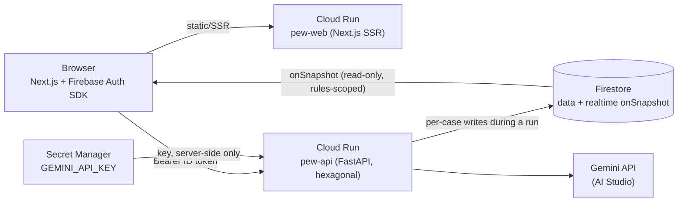

# Prompt Evaluation Workbench (pew)

## What it is

Prompt Evaluation Workbench is a production-ready web app for validating, grading, and
iteratively improving LLM prompts. **Firebase Authentication** (email + Google) signs users
in; roles (viewer / contributor / maintainer / administrator) are enforced server-side on
every endpoint. **Firestore** stores the entire workspace — projects, immutable prompt
versions, private test datasets, runs, and improvement cycles — and doubles as the realtime
channel: evaluation results stream into the browser via `onSnapshot` as each test case
completes. Two stateless services run on **Cloud Run**: a Next.js frontend (`pew-web`) and a
FastAPI evaluation engine (`pew-api`) that executes prompts with **Gemini 3.1 Pro Preview**,
grades outputs with **Gemini 3.6 Flash** using structured JSON output, and generates
evidence-linked improvement suggestions — all inside budget- and iteration-capped cycles
whose cost is estimated with the Gemini `count_tokens` API before a single token is spent.

Built for the Google Gen AI Academy APAC Cohort 3 ideathon (`#AccelerateAIwithCloudRun`).
Deployed URL: `<deployed pew-web URL — see Task 10's submission checklist>`.

## Architecture



Both Cloud Run services are stateless and scale to zero. The API is hexagonal
(ports and adapters): the domain layer (`api/app/domain/`) is pure Python with zero
`google.*` imports, so the product's actual logic — validation rules, scoring, the
improvement-cycle state machine — is unit-testable without any cloud dependency.

## Firebase, Firestore, Cloud Run, and Gemini — why this shape

**Firestore doubles as the realtime channel.** Rather than a separate WebSocket/SSE layer,
every evaluation run and improvement cycle is a Firestore document tree that the API writes
to case-by-case as work completes, and that the browser subscribes to read-only via
`onSnapshot` (security rules deny all client writes — only the API's service account writes,
and it enforces RBAC before doing so). This collapses "durable state" and "realtime UI" into
one system: no message bus, no polling, and a client that survives a page refresh mid-run for
free because it just resubscribes to the same document.

**Cloud Run's request-scoped model shaped the Cloud Tasks decision.** Cloud Run only
guarantees CPU while a request is being handled and scales instances to zero between them, so
a long-lived background worker (e.g. Celery + a broker) would be throttled or killed inside
the container — Celery's assumption of an always-on process is the opposite of Cloud Run's
scale-to-zero design. Early phases run an improvement-cycle iteration inline inside a single
(long-timeout) API request; from Phase 5 onward, `pew-api` instead enqueues each iteration as
a Cloud Task that calls back into an internal, OIDC-only endpoint. That endpoint is
idempotent and reloads cycle state from its Firestore document on every invocation, so a
cycle survives client disconnects, instance restarts, and retries — durable execution without
ever needing an always-on worker process. Both mechanisms implement the same `TaskQueue`
port, so the switch was a wiring change, not a rewrite.

**Gemini is the sole v1 adapter behind a provider port.** `LLMProvider` (`api/app/ports/llm.py`)
defines `execute` / `grade` / `suggest` / `generate_cases` / `count_tokens` as an abstract
contract; `api/app/adapters/gemini.py` is the only implementation shipped in v1, because
Gemini via AI Studio is an ideathon requirement, not a product identity. Every call goes
through the port, graders use `temperature=0` with a structured JSON response schema, and a
`FakeLLMProvider` test double satisfies the same port for CI and rehearsals — so swapping in
another provider later, or running the whole test suite without spending a token, requires no
change to any calling code.

## Local setup

Prerequisites: Node 24, Python 3.12, a JDK (Java 21) for the Firebase emulators, and the
Firebase CLI (`npm install -g firebase-tools`).

1. **Start the Firebase emulators** (Firestore, Auth, and the emulator UI — ports come from
   `firebase.json` at the repo root):

   ```bash
   firebase emulators:start --project demo-pew-test --only firestore,auth
   ```

   Firestore emulator: `localhost:8080` · Auth emulator: `localhost:9099` · emulator UI:
   `localhost:4000`.

2. **Configure env files** from the checked-in examples:

   ```bash
   cp web/.env.local.example web/.env.local
   cp api/.env.example api/.env
   ```

   For local emulator development, `api/.env` needs the emulator hosts uncommented and the
   project id set to match the running emulator session:

   ```bash
   # api/.env
   FIREBASE_PROJECT_ID=demo-pew-test
   CORS_ORIGINS=http://localhost:3000
   FIRESTORE_EMULATOR_HOST=localhost:8080
   FIREBASE_AUTH_EMULATOR_HOST=localhost:9099
   ```

   `web/.env.local` should point at the local API and the same emulator project:

   ```bash
   # web/.env.local
   NEXT_PUBLIC_API_URL=http://localhost:8000
   NEXT_PUBLIC_FIREBASE_CONFIG={"apiKey":"demo","authDomain":"demo-pew-test.firebaseapp.com","projectId":"demo-pew-test","appId":"1:0:web:0"}
   NEXT_PUBLIC_USE_EMULATOR=true
   ```

3. **Install dependencies:**

   ```bash
   cd api && pip install -e ".[dev]"
   cd web && npm ci
   ```

4. **Seed demo data** — two projects and three prompts (budgets ≤ $0.50) plus four demo
   Firebase Auth accounts, one per role (`asha@acme.dev` / administrator through
   `dev@acme.dev` / viewer; password `correct horse battery staple`). Safe to re-run — every
   write is keyed. Run with the emulator env vars from step 2 set:

   ```bash
   cd api
   FIRESTORE_EMULATOR_HOST=localhost:8080 \
   FIREBASE_AUTH_EMULATOR_HOST=localhost:9099 \
   FIREBASE_PROJECT_ID=demo-pew-test \
   python -c "import asyncio; from scripts.seed import run; asyncio.run(run(force=True))"
   ```

5. **Run the dev servers**, each in its own terminal:

   ```bash
   # api — USE_FAKE_LLM avoids spending real Gemini tokens locally; set GEMINI_API_KEY
   # instead (and drop USE_FAKE_LLM) to exercise real Gemini calls
   cd api
   FIRESTORE_EMULATOR_HOST=localhost:8080 \
   FIREBASE_AUTH_EMULATOR_HOST=localhost:9099 \
   FIREBASE_PROJECT_ID=demo-pew-test \
   USE_FAKE_LLM=true \
   uvicorn app.main:app --reload --port 8000
   ```

   ```bash
   # web
   cd web && npm run dev
   ```

   Open `http://localhost:3000` and sign in with one of the seeded demo accounts.

## Deploy your own

1. **Create a GCP/Firebase project** (Firebase and GCP share the same project id, so Auth,
   Firestore, and Cloud Run share IAM).
2. **Enable the required APIs** (devspec §2's service map): Cloud Run, Firebase
   Authentication, Firestore (Native mode), Secret Manager, Artifact Registry, Cloud Tasks,
   Cloud Logging / Error Reporting.
3. **Deploy Firestore rules and indexes:**

   ```bash
   firebase deploy --only firestore:rules,firestore:indexes --project <your-project-id>
   ```

4. **Store the Gemini key in Secret Manager** as `gemini-api-key` (get a key from
   [Google AI Studio](https://aistudio.google.com/)) — it is mounted into `pew-api` only, via
   `--set-secrets GEMINI_API_KEY=gemini-api-key:latest` at deploy time, and is never present
   in the repo, an env file, or the browser bundle.
5. **Set up Workload Identity Federation** for `.github/workflows/deploy.yml` (keyless —
   no service-account JSON in GitHub secrets): create a WIF pool/provider trusting your GitHub
   repo, and a deployer service account granted `run.admin`, `artifactregistry.writer`,
   `iam.serviceAccountUser` (on the runtime service accounts), and `firebaserules.admin`.
   Set the repo variable `WIF_PROVIDER` (and `API_URL`, `FIREBASE_WEB_CONFIG` used by the web
   build) to match.
6. **Push to `main`** — `deploy.yml` builds and pushes both Docker images to Artifact
   Registry, deploys `pew-api` and `pew-web` to Cloud Run, and deploys Firestore rules/indexes.
   Cloud Run keeps prior revisions, so rollback is
   `gcloud run services update-traffic pew-api --to-revisions PREV=100`.

## Testing

```bash
# api
cd api && ruff check . && mypy scripts app && pytest tests --ignore=tests/integration

# Firestore-dependent api tests, against the emulator
firebase emulators:exec --project demo-pew-test --only firestore,auth "pytest tests/integration -v"

# web
cd web && npm run lint && npx tsc --noEmit && npx vitest run

# end-to-end (Playwright), against emulators + a running api + web dev server
cd web && npx playwright test
```

## Licence

MIT — see [`LICENSE`](./LICENSE).
