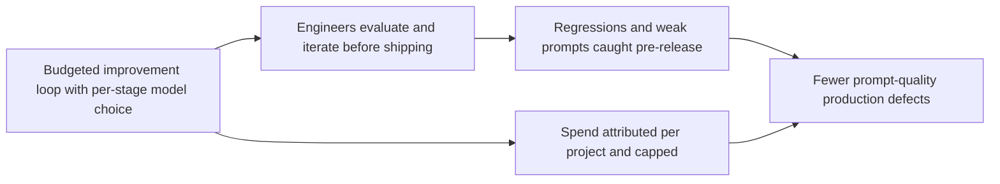
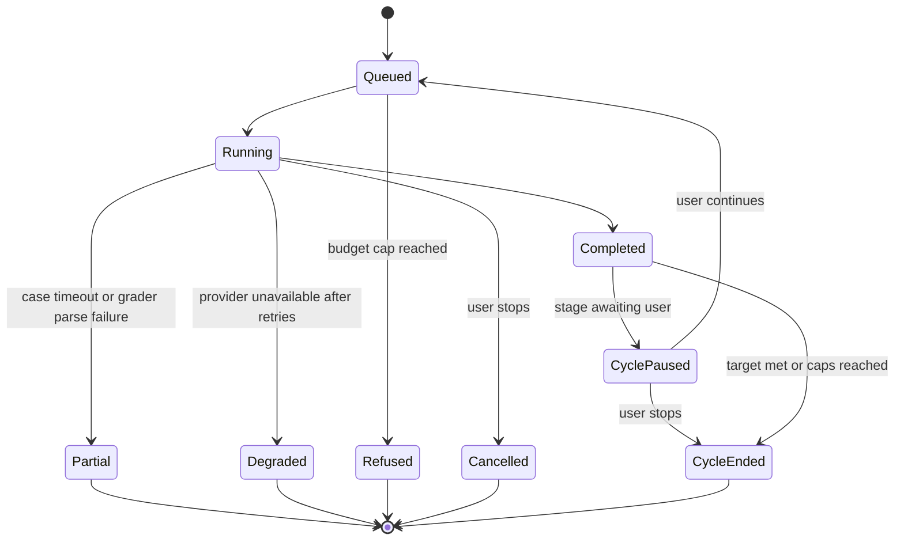
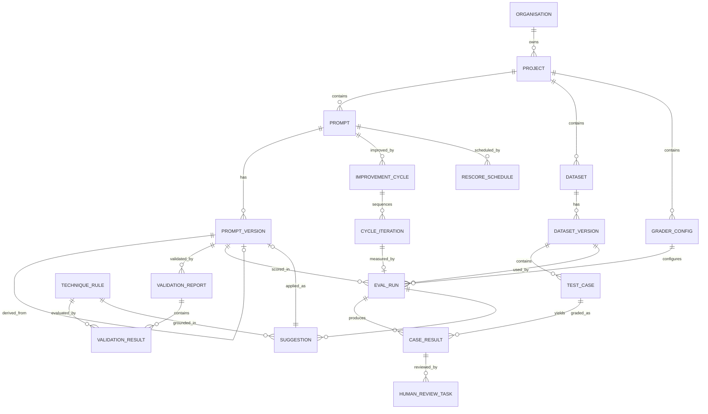
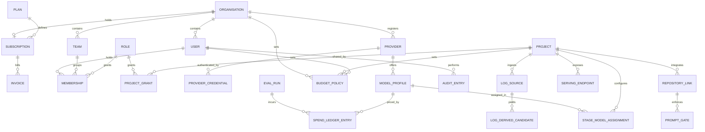
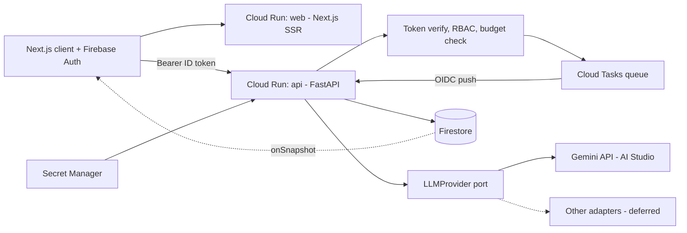

# PRD: Prompt Evaluation Workbench

| | |
|---|---|
| **Status** | draft |
| **Owner** | *(unassigned — name the requesting human before review)* |
| **Version** | 3.0 |
| **Last updated** | 2026-09-05 |
| **PRD ID** | prompt-eval-workbench-v3 |
| **Supersedes** | prompt-eval-workbench-v2 |

> **The choice §5.2 asked for has now been made.** v1 is a competition build for the Google Gen AI Academy APAC Cohort 3 ideathon, which fixes both the scope (roughly Phase A plus selected governance slices — recorded in §5.2) and the platform (Cloud Run, Firebase Authentication, Firestore, and the Gemini API in AI Studio — recorded in §7.2 and §7.4) `[SOURCE: ideathon submission rules, supplied 2026-09-05]`. Everything this version changes flows from those two decisions; the product intent, user stories, and acceptance criteria of v2 are otherwise unchanged. The build plan operationalising this scope lives in a separate devspec (`docs/devspec.md`), which is the engineering companion to this document.

---

## 1. Overview & Purpose

A provider-agnostic prompt evaluation and improvement workbench for engineering teams that scores a prompt against a generated test dataset, proposes technique-grounded revisions, and repeats under the engineer's control until they are satisfied or their budget cap is reached — in order to catch prompt failures before production users hit them. Teams benefit by watching a number move under a spend ceiling they set, at the moment they are deciding whether a prompt is ready to ship.

Three things changed between v1 and this version. The product is no longer tied to a single model vendor: any LLM API can be used, and a different model can be assigned to each stage of the pipeline `[SOURCE: requester statement, 2026-09-04]`. The improvement loop is now explicitly human-controlled and budgeted rather than automatic. And the six items previously proposed as out of scope have all been pulled into scope by instruction `[SOURCE: requester statement, 2026-09-04]`.

**Ask:** a scope decision before build starts. §5.2 sets out what fits in the three-month window at the stated team size and what does not. Approving this document without making that call means the deadline is met by dropping whatever is unfinished at week thirteen, which will be decided by accident rather than by you.

---

## 2. Problem Statement

Engineers write a prompt, test it by hand a handful of times, decide it looks right, and ship it. The prompt then meets inputs nobody tried, and produces output the application was not built to handle. The failure is discovered by a user or a bug report rather than before release. `[SOURCE: requester statement, 2026-09-03]`

Two things make this hard to escape without tooling:

- **There is no number.** "This version is better" is a judgement made by the person who just wrote it. A regression introduced while fixing something else is invisible until it also reaches production.
- **The inputs that break a prompt are the ones nobody thought of.** Hand-testing samples the input space where the author's attention already is, which is precisely where the prompt already works.

The supplied course material names this as the default failure pattern rather than an unusual one: testing a prompt once and shipping it risks breaking in production, and testing it a few times still leaves users providing outputs the author never considered. `[SOURCE: prompt_eval_001.png]`

A third pressure appears in this version. Teams are not on one model vendor and do not stay on one model. When a provider ships a new version, every prompt tuned against the old one is silently untested against the new one, and nobody re-checks because re-checking by hand costs as much as writing the prompt did. `[SOURCE: requester statement, 2026-09-04]`

**Evidence:** first-hand report from the requesting engineering team `[SOURCE: requester statement, 2026-09-03]`, corroborated by the supplied methodology material `[SOURCE: prompt_eval_001.png]`. Frequency, mean time to detection, and engineer hours lost per incident remain **not quantified** — `[PLACEHOLDER — VALIDATE]`.

**Cost of not solving:** every prompt change continues to carry undetected regression risk, and the cost of a bad prompt is paid by a production user rather than by a test run. Every model upgrade carries the same risk again, across every prompt at once. Quantified cost `[PLACEHOLDER — VALIDATE]`.

**Why now:** the mechanism is proven in notebook form `[SOURCE: 001_prompt_evals_complete.ipynb]` and the technique catalogue is written down `[SOURCE: Prompt_engineering_002.png, Prompt_engineering_003.png, Prompt_engineering_004.png, Prompt_engineering_005.png]`. The remaining work is productising, not discovery.

---

## 3. Target Users & Personas

Personas remain **inferred, not validated**. Confirm before review.

**P1 — Application engineer, primary.** Writes prompts inside product code, comfortable with Python and TypeScript `[SOURCE: requester statement, 2026-09-03]`. Their goal is to ship a feature that behaves and get back to the rest of it. **Hard to serve because** the honest comparison is against thirty seconds of manual trial. An evaluation run takes roughly thirty seconds even on a small dataset with a fast model `[SOURCE: prompt_eval_004.png]`, so the tool loses on raw speed and must win on the information it returns. Team size, seniority mix, and prompt-change frequency `[PLACEHOLDER — VALIDATE]`.

**P2 — Reviewer or technical lead, secondary.** Approves a prompt change without having written it, and needs evidence that the change is an improvement rather than a rewrite. Existence as a distinct role unconfirmed `[PLACEHOLDER — VALIDATE]`.

**P3 — Administrator, secondary.** Manages teams, users, roles, and budgets across the organisation `[SOURCE: requester statement, 2026-09-04]`. Answers "who spent what and on which model" and "who can see the project containing customer data". **Hard to serve because** their work is invisible when it goes well and urgent when it does not: the first time an admin opens the budget screen is usually the day after a runaway run. Whether this is a dedicated role or an engineering lead wearing a second hat `[PLACEHOLDER — VALIDATE]`.

A fourth audience remains in the stated future: external SaaS customers `[SOURCE: requester statement, 2026-09-03]`. Tenancy, plans, and billing are now in scope to serve them (§5), which makes them a v1 persona in the data model even though no v1 feature is designed for them yet. This tension is noted in §5.2 and A9.

---

## 4. Goals & Success Metrics

**Business objective:** reduce production defects caused by prompt output quality, reduce the engineering time spent diagnosing them, and keep the model spend of doing so predictable and attributable.

**Product objective:** an engineer runs an improvement cycle before shipping a prompt change, stops it when satisfied, and uses the score to decide whether to ship.

**Causal chain:**

### 4.1 Metrics

| ID | Type | Metric | Baseline | Target | Window |
|---|---|---|---|---|---|
| M1 | Leading | Share of prompt changes promoted with a linked evaluation run | `[PLACEHOLDER — VALIDATE]` (assume 0 — no tooling exists) | 70% | 60 days post-launch |
| M2 | Leading | Share of improvement cycles reaching the user's target score before hitting the iteration or budget cap | 0 (feature does not exist) | 50% | 60 days post-launch |
| M3 | Lagging | Production defects attributed to prompt output quality, per quarter | `[PLACEHOLDER — VALIDATE]` | 50% reduction | 2 quarters |
| M4 | Guardrail | Median elapsed time from opening a prompt to merging the change | `[PLACEHOLDER — VALIDATE]` | No increase | Ongoing |
| M5 | Guardrail | Model spend per active engineer per month, and share of budget periods ending within cap | 0 (no evaluation traffic today) | Within ceiling; 100% of periods within cap | Ongoing |

Five metrics is one above the usual ceiling and the extra one is deliberate. **M2 is the only metric that tests whether the suggestion engine works at all.** Assumption A3 says applying a catalogue technique measurably improves this team's prompts; if cycles routinely exhaust their iteration cap without reaching target, A3 is false and the product is a scoring harness with an expensive decoration attached. M2 is how that gets discovered in week eight rather than month six.

M4 exists because the fastest route to high adoption is a mandatory gate that quietly adds a day to every change. M5 exists because every stage of every iteration is billable traffic, and the improvement loop multiplies it — see §7.2 for the arithmetic and for the runaway case that motivates hard caps rather than soft alerts.

**Failure threshold — proposed, `[PLACEHOLDER — VALIDATE]`:** two conditions, either of which prompts reassessment. If by day 60 fewer than one third of prompt changes carry an evaluation run, stop building features and interview the engineers who skipped it. If M2 sits below 25% at day 60, stop extending the suggestion engine and re-examine whether the score is discriminating enough to steer on — that is a signal about A1 and A3, not about the number of techniques in the catalogue.

### 4.2 Tracking events

| Event | Properties | Feeds |
|---|---|---|
| `prompt_version_created` | `project_id`, `prompt_id`, `version`, `source` (manual \| suggestion_applied \| rescore) | M1 |
| `validation_run_completed` | `prompt_version_id`, `rules_failed[]` | M1 |
| `cycle_started` | `cycle_id`, `prompt_id`, `target_score`, `max_iterations`, `budget_cap` | M2 |
| `cycle_iteration_completed` | `cycle_id`, `iteration_no`, `composite_score`, `cost_usd` | M2, M5 |
| `cycle_ended` | `cycle_id`, `iterations_used`, `final_score`, `end_reason` (target_met \| user_stopped \| iteration_cap \| budget_cap \| error) | M2, M5 |
| `eval_run_started` | `eval_run_id`, `prompt_version_id`, `dataset_id`, `case_count`, `stage_models` | M1, M5 |
| `eval_run_completed` | `eval_run_id`, `composite_score`, `duration_ms`, `input_tokens`, `output_tokens`, `cost_usd`, `status` | M1, M4, M5 |
| `suggestion_generated` | `eval_run_id`, `technique`, `suggestion_id` | M2 |
| `suggestion_applied` | `suggestion_id`, `technique`, `new_version_id`, `edited_by_user` (bool) | M2 |
| `version_comparison_viewed` | `baseline_version_id`, `candidate_version_id`, `score_delta` | M1 |
| `prompt_version_promoted` | `prompt_version_id`, `linked_eval_run_id` (nullable), `promotion_channel` | M1, M3 |
| `budget_threshold_crossed` | `scope`, `scope_id`, `percent_of_cap`, `action` (warned \| blocked) | M5 |
| `rescore_completed` | `prompt_id`, `previous_model`, `new_model`, `score_delta` | M3 |

`prompt_version_promoted` carries `promotion_channel` because promotion now has real triggers in scope: the serving path, the CI gate, and an SDK read all produce one. Q8 from v1 is closed by the expanded scope — see §5.

---

## 5. Scope, Phasing & Trade-offs

### 5.1 In scope

All six items previously proposed as out of scope have been moved into scope by instruction `[SOURCE: requester statement, 2026-09-04]`. The full scope is now:

**Core evaluation loop**
- Projects containing prompts, with immutable versions carrying timestamp, author, and a change note
- Static prompt validation against the technique catalogue, run with no API call
- Dataset generation from a task description and input specification, plus manual editing
- Evaluation runs producing a composite score from a code grader and a model grader
- Per-case detail: rendered prompt, raw output, both sub-scores, grader reasoning
- Technique-grounded suggestions, applicable as a new version or editable before applying
- Side-by-side comparison of two versions over the same dataset

**Human-controlled improvement cycle**
- Per-cycle settings for target score, maximum iterations, and budget cap
- A pause at every stage — dataset, run, grading, suggestion — at which the user can inspect, edit, add their own input, continue, or stop
- Stop when satisfied, or request another iteration
- Periodic rescoring of a prompt against updated models, on a schedule, with score delta reported

**Provider and model management**
- Any LLM API, behind a provider abstraction. **v1 ships the Gemini adapter only** (competition requirement, §5.2 decision); the port keeps the field open without code change to the domain
- Independent model selection per stage: dataset generation, target execution, grading, suggestion
- Per-provider credentials, per-model cost rates, and cost attribution per call

**Governance**
- Role-based access control, with an admin able to manage teams, users, roles, and budgets
- Budget policies at organisation, project, and user scope, with alerting and hard stops
- Project and prompt sharing across teammates
- Audit log

**Formerly out of scope, now in scope**
- Providers beyond the launch adapter (v1 launch adapter: Gemini)
- CI integration and pull-request gating
- Human grading and annotation queues
- Prompt execution in production traffic paths, and a runtime serving role
- Customer-facing tenancy, billing, and plan management
- Automatic dataset generation from production logs

**Out of scope:** by instruction, nothing is excluded. This has a consequence worth stating rather than leaving implicit: an implementing engineer or agent treats an absent exclusion as permission, so an empty list is the most expensive possible instruction. The following minimal exclusions are **proposed for confirmation** — mobile and native applications (web only `[SOURCE: requester statement, 2026-09-04]`), on-premises or self-hosted deployment, model fine-tuning or training, and multi-turn agent or tool-use trajectory evaluation as distinct from single-turn prompt evaluation.

**v0 tests:** that a composite score is stable and discriminating enough that an engineer trusts it to make a ship decision, and that a bounded improvement cycle reaches a target score often enough to be worth running. Everything else in the scope above assumes both hold.

### 5.2 Capacity, and the decision this document is asking for

**Stated team:** 1 solution architect, 1 fullstack developer, 1 tester, partial DevOps engineer. **Stated timeline:** 3 months. `[SOURCE: requester statement, 2026-09-04]`

That is roughly 2.5 full-time equivalents over thirteen weeks, of which **build capacity is approximately 1.5 engineers** — one fullstack developer plus whatever share of the architect's time is spent writing code rather than designing, reviewing, and coordinating. Call it 4 to 5 engineer-months of implementation.

The scope in §5.1 resolves to roughly 30 domain entities, 18 user stories, and six subsystems that in most organisations belong to different teams: an evaluation engine, a provider abstraction, an RBAC and audit layer, a metering and billing system, a CI integration, and a production serving path. A defensible estimate for that work is 18 to 30 engineer-months. `[ASSUMED — confidence: medium]`

**The scope is therefore four to six times the capacity.** This is not a reason to reduce ambition, and it is not a judgement about the team. It is a scheduling fact with exactly three available responses: extend the timeline, add people, or choose what lands first. Approving this document without choosing means the third response happens anyway at week thirteen, decided by whatever happened to be unfinished.

**Decision recorded, 2026-09-05: choose what lands first.** The requester is entering v1 into the Google Gen AI Academy APAC Cohort 3 ideathon `[SOURCE: requester statement, 2026-09-05]`, which settles the question this section raised. v1 scope is Phase A in full, plus these slices of Phase B: the four-role RBAC model enforced server-side (US-11 core), the append-only audit trail for role changes (US-18 core), per-project budget caps enforced as hard stops at cycle scope (US-10 core), and manual case grading pulled forward from Phase C (US-12 core) because the composite-blend design already carries it. **Explicitly deferred from v1:** invitations and team objects (first user becomes administrator; admins reassign roles in-app), budget policies at organisation and user scope, scheduled rescoring (US-14), CI gating (US-13), production serving (US-15), log-derived datasets (US-16), tenancy/plans/billing (US-17), bring-your-own provider keys, and every provider adapter except Gemini. One further v1 simplification: one active improvement cycle at a time, org-wide — concurrency is a Phase B unlock, not a v1 requirement. Deferred items keep their places in the data model per §5.3's preservation rule.

Two items deserve specific attention before any phasing decision:

**The production serving path changes what this product is.** An evaluation workbench that goes down costs an engineer an hour. A serving proxy that goes down takes the product with it. Adding a runtime serving role imports an availability target, a failover story, latency budgets on the hot path, capacity planning, and on-call — with a partial DevOps engineer. It also means customer data flows through the system continuously rather than occasionally, which materially changes the compliance position in §7.2.

**Customer billing and tenancy contradicts the stated sequencing.** The requester's own position is to start internal and distribute as SaaS once stable `[SOURCE: requester statement, 2026-09-03]`. Plans, metering, payment processing, invoicing, tax handling, and dunning are a finance and compliance workstream, not a feature. Building them before the internal tool has proven A1 and A3 means building billing for a product that may not work.

### 5.3 Proposed phasing

A recommendation, not a decision. It assumes the capacity above and no change to the team.

| Phase | Weeks | Contents | Rationale |
|---|---|---|---|
| **A — The loop** | 1–6 | Projects, prompts, versions with change notes. Provider abstraction and per-stage model selection. Dataset generation. Eval runs with code and model graders. Per-case detail. Comparison. Suggestions. Improvement cycle with target score, iteration cap, budget cap, and stage-by-stage user control. Two roles (admin, member) | This is the smallest thing that tests A1, A2 and A3. Nothing downstream is worth building if the score does not discriminate |
| **B — Governance** | 7–10 | Full RBAC and admin console. Budget policies at three scopes with alerts and hard stops. Spend ledger and attribution. Project and prompt sharing. Audit log. Periodic rescoring | Governance is what makes the tool safe to open to the whole team rather than to its authors |
| **C — Integration** | 11–13 | Human grading and annotation queue. CI integration and pull-request gating | Both depend on the loop being trusted first. A gate on an untrusted score gets disabled within a sprint |
| **D — Deferred, recommended** | Beyond the window | Production serving path. Customer tenancy, plans, and billing. Automatic dataset generation from production logs | The first two are separate products by reliability and compliance class. The third is blocked on the compliance answer in §7.2 regardless |

Phase C is at genuine risk even in this shape. If the Phase A findings on A1 require rework of the grading approach, C is what gets cut, and that should be the agreed sacrifice rather than a surprise.

**Execution note (v3).** The ideathon devspec decomposes the v1 scope above into build phases 0–6 with exit criteria and a CI/CD pipeline; where this section speaks in product phases (A–D), the devspec speaks in build order. They agree on contents; the devspec governs sequencing.

**What the phasing preserves.** Every deferred item stays in the data model from day one. Tenancy identifiers, provider abstraction, cost attribution per call, and the audit log are all carried in Phase A even where no Phase A feature uses them, because retrofitting any of the four is substantially more expensive than carrying them unused. See §7.4.

### 5.4 Alternatives considered

| Option | Trade-off | Chosen? |
|---|---|---|
| Build the workbench | Highest cost; full control over the technique catalogue and grading contract | Yes — `[SOURCE: requester statement, 2026-09-03]` |
| Adopt an existing evaluation platform | Far cheaper to first result; several handle multi-provider evaluation and CI gating already. Less control, and the technique-grounded suggestion layer is unlikely to exist off the shelf | Not documented as evaluated — see Q1. This question gets harder to ignore as scope grows, not easier |
| Keep the notebook workflow | Zero build cost; no persistence, sharing, versioning, or budget control | No — fails the multi-user requirement |
| Ship a CLI instead of a web app | Fits engineer workflow and CI naturally; loses side-by-side comparison, admin console, and shared history | No — web app only `[SOURCE: requester statement, 2026-09-04]` |
| Full scope in three months | Meets the date on paper | Not recommended — see §5.2 |
| Phase A–C in three months, D deferred | Ships a working, governed, integrated internal tool within the window | Recommended — requires the requester's decision |

---

## 6. Features, User Stories & Acceptance Criteria

**Epic:** As an engineering team, we want to score a prompt against a repeatable test set, be told specifically how to improve it, and iterate under our own control and budget, so that we ship prompt changes on evidence rather than impression.

Terms used throughout: a **prompt version** is an immutable snapshot of prompt text; a **stage** is one of dataset generation, target execution, grading, or suggestion, each independently assignable to a model; a **comparability tuple** is the set (dataset version, grader configuration, target model, temperature) that must be identical for two scores to be compared; an **improvement cycle** is a bounded sequence of iterations under a target score, iteration cap, and budget cap; the **technique catalogue** is the rule set derived from the supplied prompt engineering material `[SOURCE: Prompt_engineering_002.png, Prompt_engineering_003.png, Prompt_engineering_004.png, Prompt_engineering_005.png]`.

Each story carries its proposed phase from §5.3.

### US-1 — Validate a prompt before spending anything on it *(Phase A)*

As an application engineer, I want static checks on my prompt text before any model call, so that I fix obvious weaknesses without waiting for a run or paying for one.

- **Why:** an evaluation run costs roughly thirty seconds and real API spend `[SOURCE: prompt_eval_004.png]`. Several high-value techniques are detectable from text alone.
- **Impact:** M1, M4.

| ID | Criterion |
|---|---|
| AC-1.1 | **Given** a prompt version whose opening line is a question rather than an instruction, **When** validation runs, **Then** the clear-and-direct rule is reported as failed, **And** the report names the technique and quotes the offending line, **And** no model API call is made |
| AC-1.2 | **Given** a prompt template referencing a variable absent from the linked dataset's input specification, **When** validation runs, **Then** the template-integrity rule fails naming the unmatched variable, **And** the check runs in both directions so a declared input never used in the template also fails |
| AC-1.3 | **Given** validation completes, **Then** every rule returns pass, fail, or not-applicable with a one-line reason, **And** not-applicable is distinguished from pass, **And** the result is stored against that prompt version |
| AC-1.4 | **Given** any prompt version, **When** validation runs, **Then** it completes within 500 ms at p95, **And** it makes zero model API calls |
| AC-1.5 | **Given** a prompt interpolating a variable over 200 characters not wrapped in an XML tag, **When** validation runs, **Then** the structure rule fails, **And** the reason names a descriptive tag rather than a generic one as the fix |
| AC-1.6 | **Given** a prompt version with failed validation rules, **When** the engineer starts an evaluation run, **Then** the run proceeds, **And** validation results are advisory only and never block execution |

AC-1.6 exists because most catalogue rules are heuristic. A tool that refuses to run over a false positive gets routed around within a week.

### US-2 — Generate an evaluation dataset *(Phase A)*

As an application engineer, I want a test dataset generated from a task description, so that my prompt is tested against inputs I would not have thought of.

- **Why:** hand-testing samples the input space where the author's attention already is `[SOURCE: prompt_eval_003.png]`.
- **Impact:** M1.

| ID | Criterion |
|---|---|
| AC-2.1 | **Given** a task description, an input specification, and a case count, **When** generation runs on the model assigned to the dataset stage, **Then** the requested number of cases is returned, **And** each carries a concrete value for every declared input variable, an expected output format, and solution criteria |
| AC-2.2 | **Given** a generated dataset, **When** the engineer edits a case, adds one, or deletes one, **Then** the change is saved, **And** each case is marked as generated or human-authored |
| AC-2.3 | **Given** the generation call returns content that does not parse as the expected structure, **When** one retry also fails, **Then** an error naming the parse failure is surfaced, **And** no partial dataset is persisted |
| AC-2.4 | **Given** a dataset used in at least one evaluation run, **When** the engineer edits any case, **Then** a new dataset version is created rather than the existing one being mutated, **And** prior runs continue to reference the version they executed against |
| AC-2.5 | **Given** the dataset stage completes within an improvement cycle, **Then** the cycle pauses for the engineer to review and edit before execution proceeds, **And** the pause is skippable per cycle setting |

### US-3 — Run an evaluation and see where it failed *(Phase A)*

As an application engineer, I want a composite score plus per-case detail, so that I know not only how good the prompt is but which inputs break it.

- **Why:** an aggregate score alone says keep working without saying where.
- **Impact:** M1, M3, M5.

| ID | Criterion |
|---|---|
| AC-3.1 | **Given** a prompt version, a dataset version, and a grader configuration, **When** the run executes, **Then** every case produces a code-grader score and a model-grader score, **And** a composite per case from the configured weights, **And** an aggregate mean across cases |
| AC-3.2 | **Given** a run in progress, **Then** completed case results appear as each finishes, **And** a completed-of-total count and running cost are visible, **And** the run can be cancelled with completed results retained |
| AC-3.3 | **Given** a run of any size, **Then** concurrent in-flight model calls are capped by a configurable limit defaulting to 3 `[SOURCE: Prompt_engineering_001.png]`, **And** the cap is adjustable per project |
| AC-3.4 | **Given** a completed run, **Then** the stored record includes prompt version, dataset version, grader configuration, the model and provider used at each stage, temperature, token counts, computed cost, and duration, **And** these are immutable once the run completes |
| AC-3.5 | **Given** a completed run, **When** the engineer opens any case, **Then** the rendered prompt, raw output, both sub-scores, and the grader's strengths, weaknesses and reasoning are shown |
| AC-3.6 | **Given** a run is eligible for asynchronous processing, **Then** the provider's batch endpoint is used where available, **And** the cost saving is reflected in the recorded cost |

AC-3.6 is a direct cost lever rather than a nicety. Batch processing carries a 50% discount on current Anthropic rates `[SOURCE: Anthropic API pricing, retrieved 2026-09-04]`, and evaluation runs are asynchronous by nature — the engineer is not waiting on a token-by-token stream.

### US-4 — Configure how grading works *(Phase A)*

As an application engineer, I want control over grading criteria and weights, so that the score reflects what my feature actually needs.

- **Why:** format and syntax are deterministic and belong to a code grader; task-following is judgement and belongs to a model grader `[SOURCE: prompt_eval_006.png]`. One opaque score makes failures unattributable.
- **Impact:** M1.

| ID | Criterion |
|---|---|
| AC-4.1 | **Given** a test case declaring an expected format of JSON, Python, or regex, **When** the code grader runs, **Then** the output is parsed with the matching parser, **And** a parse success scores 10 and a parse failure scores 0 `[SOURCE: 001_prompt_evals_complete.ipynb]` |
| AC-4.2 | **Given** an engineer supplies additional evaluation criteria as free text, **When** a run executes, **Then** that text is included in the model grader's instructions for every case `[SOURCE: Prompt_engineering_001.png]` |
| AC-4.3 | **Given** a grader configuration, **When** the engineer sets code and model grader weights, **Then** the composite uses those weights, **And** the default is equal weighting |
| AC-4.4 | **Given** a grader configuration, **Then** the grading model, its provider, and its temperature are explicit fields, **And** temperature defaults to 0 for grading calls |
| AC-4.5 | **Given** a model grader response omitting strengths, weaknesses, or reasoning, **Then** the response is rejected and retried, **And** a bare score is never accepted `[SOURCE: prompt_eval_005.png]` |
| AC-4.6 | **Given** a model grader response, **Then** each weakness carries a classification drawn from the technique catalogue enumeration plus an "other" value, **And** the classification is stored as a queryable field rather than free text |

AC-4.6 is what makes US-5 buildable. Detecting that a weakness recurs across cases means clustering free-text grader prose, which is expensive and unreliable; asking the grader to classify against a closed list turns the same job into a `GROUP BY`.

AC-4.4 and AC-4.5 defend the same thing. The supplied material warns model graders drift toward middling scores when asked for a number without justification `[SOURCE: prompt_eval_005.png]`, and the reference implementation runs at the SDK default temperature of 1.0 `[SOURCE: 001_prompt_evals_complete.ipynb]`, adding run-to-run variance to the one number the product depends on.

### US-5 — Receive a specific suggestion, edit it, apply it *(Phase A)*

As an application engineer, I want suggestions that name a technique and rewrite my prompt, and I want to change them before they are applied, so that improving the prompt does not depend on my recalling the catalogue and does not take the decision away from me.

- **Why:** this separates the workbench from a scoring harness. The supplied material shows the techniques moving a score from 2.32 to 3.92 to 7.86 on one task family `[SOURCE: Prompt_engineering_002.png, Prompt_engineering_003.png]`.
- **Impact:** M2, M3.

| ID | Criterion |
|---|---|
| AC-5.1 | **Given** a completed evaluation run, **When** suggestions are generated on the model assigned to the suggestion stage, **Then** each names exactly one technique from the catalogue, **And** cites evidence as a failed validation rule or a weakness classification recurring across at least two cases, **And** includes complete proposed prompt text |
| AC-5.2 | **Given** a suggestion, **When** the engineer applies it, **Then** a new prompt version is created carrying a parent reference, a change note, and a source of suggestion-applied, **And** no existing version is modified |
| AC-5.3 | **Given** a suggestion, **When** the engineer edits the proposed text before applying, **Then** the resulting version records both the originating suggestion and that it was user-modified |
| AC-5.4 | **Given** a proposed rewrite that adds or removes a template variable, **Then** it is flagged as dataset-invalidating, **And** the engineer is told the dataset must be regenerated before scores are comparable |
| AC-5.5 | **Given** a run with several applicable techniques, **Then** each is offered as a separate suggestion, **And** no single suggestion bundles two techniques, so any score change is attributable to one cause |
| AC-5.6 | **Given** the suggestion stage completes within a cycle, **Then** the engineer may add their own written guidance which is passed to the next iteration alongside the suggestion |

### US-6 — Compare two versions and catch regressions *(Phase A)*

As a reviewer, I want two versions scored side by side, so that I can tell whether a change is an improvement rather than a rewrite.

- **Why:** §2 states the core problem as having no number to compare against.
- **Impact:** M1, M3.

| ID | Criterion |
|---|---|
| AC-6.1 | **Given** two runs of the same prompt sharing an identical comparability tuple, **Then** both aggregate scores, the delta, and a per-case delta table are shown |
| AC-6.2 | **Given** two runs whose comparability tuples differ in any element, **Then** the comparison is labelled not comparable, **And** the differing element is named, **And** no aggregate delta is displayed |
| AC-6.3 | **Given** a comparison where the aggregate improved, **When** any individual case scored lower than in the baseline, **Then** those cases are listed under a distinct regression heading, **And** the count is shown alongside the aggregate delta |

### US-7 — Organise work in projects and share it *(Phase A, sharing in Phase B)*

As an application engineer, I want prompts organised in projects with full version history, and shareable with teammates, so that a colleague's evaluated prompt is reusable and review does not depend on my local notebook.

- **Why:** the notebook workflow has no persistence or sharing; the score dies with the kernel `[SOURCE: requester statement, 2026-09-04]`.
- **Impact:** M1.

| ID | Criterion |
|---|---|
| AC-7.1 | **Given** an organisation, **When** a user creates a project, **Then** prompts, datasets, grader configurations, and runs are scoped to it |
| AC-7.2 | **Given** a prompt with several versions, **Then** the history lists each version with author, timestamp, change note, source, and the aggregate score of its most recent run |
| AC-7.3 | **Given** a prompt version, **When** any user attempts to edit its text in place, **Then** the edit is refused and a new version is offered instead |
| AC-7.4 | **Given** a project, **When** its owner shares it with a user or team at a named role, **Then** that grant is recorded and takes effect immediately, **And** it is revocable, **And** both actions are written to the audit log |

### US-8 — Choose a provider and model for each stage *(Phase A)*

As an application engineer, I want a different model for dataset generation, execution, grading, and suggestion, so that I test against the model I actually ship on while paying small-model rates for the supporting stages.

- **Why:** the supplied material recommends a faster, cheaper model for test data generation specifically `[SOURCE: prompt_eval_003.png]`. Generalised across four stages this is the single largest lever on M5 — current rates run from $1/$5 per million tokens at the low end to $10/$50 at the high end `[SOURCE: Anthropic API pricing, retrieved 2026-09-04]`, a tenfold spread.
- **Impact:** M5, M1.

| ID | Criterion |
|---|---|
| AC-8.1 | **Given** a project, **When** the user assigns a provider and model to each of the four stages, **Then** each stage's calls use its assigned model, **And** the assignment is recorded on every run for reproducibility |
| AC-8.2 | **Given** a provider registered by an administrator, **Then** it is selectable by any project member with the relevant role, **And** its credentials are never exposed to the browser or written to logs |
| AC-8.3 | **Given** a model with recorded input and output rates, **When** any call completes, **Then** its cost is computed from the token counts and the recorded rate, **And** written to the spend ledger against organisation, project, user, run, and stage |
| AC-8.4 | **Given** an OpenAI-compatible endpoint, **When** an administrator registers it as a custom provider with a base URL and model identifier, **Then** it functions as a first-class provider without code change |
| AC-8.5 | **Given** a run whose target model differs from a prior run of the same prompt, **Then** the two are treated as not comparable under AC-6.2 |

AC-8.4 is the pragmatic route to "any LLM API". Most providers expose an OpenAI-compatible surface; supporting that shape plus a small number of native adapters covers the field without one adapter per vendor.

**v1 note (v3).** AC-8.1, 8.3, and 8.5 ship in v1 with the model list restricted to Gemini variants — `gemini-2.5-pro` as the execution default, `gemini-2.5-flash` as the default for dataset generation, grading, and suggestions — which preserves the cheap-supporting-stages economics this story exists for (the price spread between Flash and Pro is roughly the same order as the spread the Why cites). AC-8.2 narrows in v1 to a single org credential held in Secret Manager, and AC-8.4 (custom OpenAI-compatible providers) is deferred with the rest of the multi-provider surface. The `LLMProvider` port in the devspec is the mechanism that makes this deferral cheap to reverse.

### US-9 — Run a bounded improvement cycle under my control *(Phase A)*

As an application engineer, I want to set a target score, an iteration cap, and a budget cap, and be able to intervene or stop at any stage, so that the tool improves my prompt without ever spending money I did not agree to.

- **Why:** this is the feature the requester describes as the product's spine `[SOURCE: requester statement, 2026-09-04]`. It is also the primary control on M5 — see the runaway arithmetic in §7.2.
- **Impact:** M2, M5.

| ID | Criterion |
|---|---|
| AC-9.1 | **Given** a prompt, **When** the engineer starts a cycle, **Then** target score, maximum iterations, and budget cap are set at start, **And** each has a project-level default |
| AC-9.2 | **Given** a running cycle, **When** any stage completes, **Then** the cycle pauses and presents the stage output, **And** the engineer may continue, edit the output, add written guidance, or stop, **And** per-stage pausing is configurable so an engineer who wants an unattended run can have one within the caps |
| AC-9.3 | **Given** a running cycle, **When** the aggregate score reaches the target, **Then** the cycle ends with reason target-met, **And** the winning version is identified |
| AC-9.4 | **Given** a running cycle, **When** the iteration cap is reached without meeting target, **Then** the cycle ends with reason iteration-cap, **And** the best-scoring version across all iterations is identified, **And** the engineer is offered a new cycle starting from it |
| AC-9.5 | **Given** a running cycle, **When** projected cost of the next iteration would exceed the remaining budget cap, **Then** the next iteration does not start, **And** the cycle ends with reason budget-cap, **And** all completed iterations are retained |
| AC-9.6 | **Given** a cycle at any point, **Then** cumulative spend, iterations used, and score-by-iteration are visible without leaving the screen |

AC-9.5 checks the projection **before** starting an iteration rather than aborting mid-way. Stopping halfway through an iteration spends the money and produces no comparable score, which is the worst of both outcomes.

### US-10 — Set and enforce budgets *(Phase B)*

As an administrator, I want budget caps at organisation, project, and user scope with alerts and hard stops, so that spend is predictable and a single careless run cannot consume the month.

- **Why:** see §7.2. A single uncapped cycle on a large dataset and a frontier model costs more than a disciplined engineer's entire month.
- **Impact:** M5.

| ID | Criterion |
|---|---|
| AC-10.1 | **Given** an administrator, **When** they set a budget for an organisation, project, or user over a period, **Then** the cap applies to all model spend in that scope, **And** the most restrictive applicable cap governs |
| AC-10.2 | **Given** spend crossing a configurable warning threshold, **Then** the scope owner and the administrator are notified, **And** the event is recorded |
| AC-10.3 | **Given** spend reaching a cap configured as a hard stop, **Then** new runs and cycles in that scope are refused with a message naming the cap and its reset date, **And** in-flight runs complete rather than being killed mid-way |
| AC-10.4 | **Given** any period, **When** an administrator opens the spend view, **Then** cost is broken down by project, user, stage, provider, and model, **And** exportable |

### US-11 — Administer teams, users, and roles *(Phase B)*

As an administrator, I want to manage teams, users, and their permissions, so that access matches responsibility and the tool is safe to open to everyone.

- **Why:** stated requirement `[SOURCE: requester statement, 2026-09-04]`. It is also the precondition for opening the tool beyond its authors.
- **Impact:** M1.

| ID | Criterion |
|---|---|
| AC-11.1 | **Given** an organisation, **Then** at least four roles exist — administrator, maintainer, contributor, viewer — **And** each permission in the system maps to a named role |
| AC-11.2 | **Given** a user without the required role, **When** they attempt any restricted action, **Then** it is refused, **And** the refusal is enforced server-side rather than by hiding the control |
| AC-11.3 | **Given** an administrator, **When** they create a team and add users, **Then** project grants may be made to the team rather than to each user individually |
| AC-11.4 | **Given** the last administrator of an organisation, **When** removal or demotion is attempted, **Then** it is refused |

AC-11.2 states the obvious because it is the most common RBAC defect: permissions enforced only in the interface, with the API left open.

### US-12 — Grade cases by hand *(Phase C)*

As a reviewer, I want to score selected cases myself and have my scores counted, so that judgement the model grader cannot make is still captured.

- **Why:** human grading offers the most flexibility for comprehensiveness, depth, and relevance, at the cost of time `[SOURCE: prompt_eval_005.png]`. It is also the only way to calibrate whether the model grader is right, which bears directly on A1.
- **Impact:** M3.

| ID | Criterion |
|---|---|
| AC-12.1 | **Given** a completed run, **When** a reviewer queues cases for human grading, **Then** those cases appear in a queue assignable to a user with the reviewer role |
| AC-12.2 | **Given** a queued case, **When** a reviewer scores it against the rubric and adds a note, **Then** the human score is stored alongside the model score rather than replacing it |
| AC-12.3 | **Given** cases carrying both a human and a model score, **Then** their agreement is reported at run level, **And** the report is available as evidence for or against A1 |
| AC-12.4 | **Given** a grader configuration, **When** human scores are enabled with a weight, **Then** the composite includes them for cases that have one, **And** the aggregate states how many cases were human-graded |

### US-13 — Gate a pull request on an evaluation *(Phase C)*

As a reviewer, I want a prompt change in a pull request to run an evaluation and report its score, so that review sees the evidence without anyone remembering to produce it.

- **Why:** M1 measures whether evaluation happens before promotion. A CI gate is the only mechanism in scope that makes it happen by default rather than by discipline.
- **Impact:** M1, M3.

| ID | Criterion |
|---|---|
| AC-13.1 | **Given** a repository linked to a project, **When** a pull request modifies a tracked prompt file, **Then** an evaluation runs against the configured dataset, **And** the score, delta against the base branch, and any regressed cases are posted to the pull request |
| AC-13.2 | **Given** a configured minimum score or maximum regression count, **When** the run breaches it, **Then** the check fails, **And** the failure names which condition was breached |
| AC-13.3 | **Given** a project without a configured threshold, **Then** the check reports the score and never fails, **And** gating is opt-in per repository |
| AC-13.4 | **Given** a pull request evaluation, **Then** its spend is attributed to the project budget, **And** it is subject to the same caps as an interactive run |

AC-13.3 keeps the first version advisory. A gate introduced before the score is trusted is a gate that gets disabled, and disabling it also removes the reporting.

### US-14 — Rescore prompts against updated models *(Phase B)*

As an application engineer, I want my prompts periodically re-evaluated against current models, so that a model upgrade does not silently degrade a prompt I tuned months ago.

- **Why:** stated requirement `[SOURCE: requester statement, 2026-09-04]`, and the third pressure in §2. Providers ship model versions faster than teams re-check prompts by hand.
- **Impact:** M3.

| ID | Criterion |
|---|---|
| AC-14.1 | **Given** a prompt, **When** a schedule is configured, **Then** it is re-evaluated at that cadence against the frozen dataset version and grader configuration, varying only the target model |
| AC-14.2 | **Given** a completed rescore, **When** the score differs from the reference run beyond a configurable threshold, **Then** the prompt owner is notified with the delta and the regressed cases named |
| AC-14.3 | **Given** a rescore, **Then** its spend counts against the project budget and is refused when the cap is reached, **And** the skipped rescore is reported rather than silently dropped |
| AC-14.4 | **Given** a rescore against a newer model version, **Then** the run records both models so the comparison is explicitly model-varying rather than appearing as a regression of the prompt |

### US-15 — Serve an approved prompt at runtime *(Phase D — recommended deferral)*

As an application engineer, I want my application to fetch the current approved version of a prompt at runtime, so that shipping a prompt change does not require a code deploy.

- **Why:** it closes the loop between the workbench and production, and provides a real `prompt_version_promoted` trigger.
- **Impact:** M1, M3.

| ID | Criterion |
|---|---|
| AC-15.1 | **Given** a prompt version marked approved, **When** an application requests it by prompt identifier and environment, **Then** the current approved version text and identifier are returned |
| AC-15.2 | **Given** a served request, **Then** the version identifier is returned alongside the text so the caller can record which version produced any given output |
| AC-15.3 | **Given** the serving API, **Then** responses are cached at the client with a published maximum staleness, **And** a serving outage degrades to the last known good version rather than to an error |
| AC-15.4 | **Given** a promotion of a new approved version, **Then** the change is recorded in the audit log with actor, timestamp, and the linked evaluation run |

AC-15.3 is the requirement that makes deferral advisable. Guaranteeing degradation to last-known-good means client-side caching, a published staleness contract, and an availability target the current DevOps allocation does not obviously cover. See §5.2.

### US-16 — Build datasets from production logs *(Phase D — recommended deferral)*

As an application engineer, I want test cases derived from real production inputs, so that my score predicts production behaviour rather than synthetic performance.

- **Why:** this is the only feature in scope that addresses assumption A2 directly, which makes it valuable and also makes it dependent on the compliance answer in §7.2.
- **Impact:** M3.

| ID | Criterion |
|---|---|
| AC-16.1 | **Given** a configured log source, **When** ingestion runs, **Then** candidate inputs are extracted into a review queue rather than added to a dataset directly |
| AC-16.2 | **Given** a candidate carrying personal or customer data, **When** it is ingested, **Then** it is redacted or masked before storage according to the project's data classification, **And** a candidate in an unclassified project is refused |
| AC-16.3 | **Given** reviewed candidates, **When** an engineer promotes them, **Then** a new dataset version is created marking each case as log-derived |

### US-17 — Sell the product to customers *(Phase D — recommended deferral)*

As an administrator at a customer organisation, I want my own isolated tenant with a plan and billing, so that my team can use the product without seeing anyone else's data.

- **Why:** stated as the eventual distribution model `[SOURCE: requester statement, 2026-09-03]` and now pulled into scope `[SOURCE: requester statement, 2026-09-04]`.
- **Impact:** business objective, not a product metric in this document.

| ID | Criterion |
|---|---|
| AC-17.1 | **Given** two tenants, **Then** no query path returns data belonging to another tenant, **And** isolation is enforced at the data layer rather than by application filtering alone |
| AC-17.2 | **Given** a plan with defined limits, **When** a tenant reaches one, **Then** the limit is enforced, **And** an upgrade path is offered |
| AC-17.3 | **Given** metered model usage, **When** a billing period closes, **Then** an invoice reflecting metered usage plus subscription is produced, **And** it reconciles to the spend ledger |

AC-17.3 is where this story stops being a feature. Invoicing that reconciles to a usage ledger brings payment processing, tax treatment, failed-payment handling, and revenue recognition — a workstream that does not fit in the residual capacity after Phases A to C.

### US-18 — Audit what happened *(Phase B)*

As an administrator, I want an immutable record of who did what, so that access to sensitive projects and changes to budgets and roles are accountable.

- **Why:** a precondition for the compliance posture proposed in §7.2, and for opening projects that may carry customer data.
- **Impact:** M5, and the compliance constraint.

| ID | Criterion |
|---|---|
| AC-18.1 | **Given** any change to roles, grants, budgets, provider credentials, or prompt approval status, **Then** an audit entry records actor, action, target, before and after values, and timestamp |
| AC-18.2 | **Given** a project marked as carrying customer data, **Then** reads of run artifacts in that project are also recorded |
| AC-18.3 | **Given** an audit entry, **Then** it cannot be edited or deleted through any application path, **And** retention follows the configured policy |

### 6.1 Failure states

| ID | Category | Criterion |
|---|---|---|
| AC-F.1 | Loading | **Given** a run exceeding 2 seconds, **Then** per-case results render progressively with a completed-of-total count and running cost, **And** no blocking full-screen spinner is shown, **And** a cancel control is available throughout |
| AC-F.2 | Timeout | **Given** a single case exceeding 60 seconds, **Then** that case is marked timed-out, **And** it is excluded from the aggregate rather than scored zero, **And** the run status becomes partial with the excluded count stated |
| AC-F.3 | Dependency failure | **Given** a provider returns a rate-limit or server error, **Then** the case is retried with exponential backoff up to 3 attempts, **And** on persistent failure the run status becomes degraded, **And** completed case results are retained |
| AC-F.4 | Empty / partial | **Given** a run that did not complete every case, **Then** the aggregate is displayed as a mean over *n* of *m* cases with both numbers visible, **And** the run is ineligible as a comparison baseline |
| AC-F.5 | Unexpected input | **Given** a model grader response that does not parse, **Then** one stricter retry is attempted, **And** on repeated failure the case carries a null model score, is flagged, and is excluded from the aggregate |
| AC-F.6 | Unexpected input | **Given** test case content interpolated into grader instructions, **Then** it is enclosed in named XML delimiters and identified as data rather than instruction `[SOURCE: Prompt_engineering_004.png]`, **And** a case attempting to direct the grader does not alter the rubric |
| AC-F.7 | Concurrency | **Given** two users saving a new version of the same prompt simultaneously, **Then** version numbers are allocated without collision, **And** the second writer is shown that a newer version exists and offered to branch from it |
| AC-F.8 | Concurrency | **Given** a run requested for a comparability tuple already in flight, **Then** the existing run is returned rather than a duplicate started |
| AC-F.9 | Dependency failure | **Given** a provider credential that is invalid, expired, or revoked, **Then** the run is refused before any case executes, **And** the message names the provider and the credential rather than surfacing a raw provider error, **And** an administrator is notified |
| AC-F.10 | Dependency failure | **Given** a provider outage and a configured fallback model for that stage, **Then** the run continues on the fallback, **And** the substitution is recorded on the run, **And** the result is marked not comparable to runs on the primary model |
| AC-F.11 | Unexpected input | **Given** an improvement cycle whose score fails to improve across two consecutive iterations, **Then** the engineer is warned that the cycle is not converging before the next iteration starts, **And** may stop without spending further |
| AC-F.12 | Empty / partial | **Given** a budget hard stop reached between iterations, **Then** the cycle ends with reason budget-cap, **And** all completed iterations and their scores are retained and comparable |
| AC-F.13 | Concurrency | **Given** two cycles started against the same prompt at once, **Then** the second is refused with a message naming the running cycle and its owner, **And** version branching is offered as the alternative |
| AC-F.14 | Dependency failure | **Given** the serving API is unavailable, **Then** clients degrade to their last cached approved version within the published staleness window, **And** the outage is alerted rather than absorbed silently |

AC-F.2, AC-F.5 and AC-F.10 all encode one rule worth stating plainly: **infrastructure failure must never be scored as prompt quality.** Assigning zero to a timed-out case makes a network problem look like a bad prompt, and the engineer then rewrites a prompt that was fine.

All seven failure categories apply and are documented. None is recorded as not-applicable.

### 6.2 Traceability

| Story | Criteria | Metric | Phase | Entity |
|---|---|---|---|---|
| US-1 | AC-1.1 – AC-1.6 | M1, M4 | A | PromptVersion, ValidationReport, TechniqueRule |
| US-2 | AC-2.1 – AC-2.5 | M1 | A | Dataset, DatasetVersion, TestCase |
| US-3 | AC-3.1 – AC-3.6, AC-F.1 – AC-F.5, AC-F.8 | M1, M3, M5 | A | EvalRun, CaseResult |
| US-4 | AC-4.1 – AC-4.6 | M1 | A | GraderConfig, CaseResult |
| US-5 | AC-5.1 – AC-5.6 | M2, M3 | A | Suggestion, TechniqueRule, PromptVersion |
| US-6 | AC-6.1 – AC-6.3 | M1, M3 | A | EvalRun, CaseResult |
| US-7 | AC-7.1 – AC-7.4, AC-F.7 | M1 | A / B | Organisation, Project, ProjectGrant, Prompt, PromptVersion |
| US-8 | AC-8.1 – AC-8.5, AC-F.9, AC-F.10 | M5, M1 | A | Provider, ProviderCredential, ModelProfile, StageModelAssignment |
| US-9 | AC-9.1 – AC-9.6, AC-F.11 – AC-F.13 | M2, M5 | A | ImprovementCycle, CycleIteration |
| US-10 | AC-10.1 – AC-10.4 | M5 | B | BudgetPolicy, SpendLedgerEntry |
| US-11 | AC-11.1 – AC-11.4 | M1 | B | Role, Membership, Team |
| US-12 | AC-12.1 – AC-12.4 | M3 | C | HumanReviewTask, CaseResult |
| US-13 | AC-13.1 – AC-13.4 | M1, M3 | C | RepositoryLink, PromptGate, EvalRun |
| US-14 | AC-14.1 – AC-14.4 | M3 | B | RescoreSchedule, EvalRun |
| US-15 | AC-15.1 – AC-15.4, AC-F.14 | M1, M3 | D | ServingEndpoint, PromptVersion, AuditEntry |
| US-16 | AC-16.1 – AC-16.3 | M3 | D | LogSource, LogDerivedCandidate, DatasetVersion |
| US-17 | AC-17.1 – AC-17.3 | Business | D | Tenant, Plan, Subscription, Invoice |
| US-18 | AC-18.1 – AC-18.3 | M5 | B | AuditEntry |

---

## 7. Assumptions, Constraints & Technical Context

### 7.1 Assumptions

| # | Assumption | Confidence | If wrong |
|---|---|---|---|
| **A1** | A model grader's score is repeatable enough that a change in it signals a real change in prompt quality | **Low** | The product's central number is noise. Every comparison, cycle, gate, and ship decision built on it is unfounded. Partly mitigated by temperature 0 (AC-4.4), mandatory reasoning (AC-4.5), and human-grader agreement reporting (AC-12.3) — none proven sufficient. See Q2 |
| **A2** | A generated dataset is representative enough of production inputs that a high score predicts production behaviour | **Low** | The tool measures synthetic performance and reports unearned confidence. US-16 addresses this directly and is the item recommended for deferral, so under the proposed phasing this assumption stays untested through the window |
| **A8** | The scope in §5.1 can be delivered by 2.5 FTE in three months | **Low** | Stated plainly: this assumption is almost certainly false as written — see §5.2. The consequence is not failure but unmanaged descoping at week thirteen. Phasing in §5.3 is the proposed correction |
| A3 | Applying a catalogue technique produces measurable score improvement on this team's prompts | Medium | The suggestion engine has no value and the product reduces to a scoring harness. M2 is the instrument that detects this |
| A4 | Engineers will run a cycle before shipping when it costs a click and a bounded amount of money | Medium | M1 stalls; the failure threshold in §4.1 is the designed response |
| A5 | An OpenAI-compatible adapter plus a small number of native adapters covers the providers this team needs | Medium | Provider support becomes one adapter per vendor, which is an ongoing maintenance cost rather than a one-time build |
| A6 | Evaluation model spend is small relative to labour, with a large tail risk from uncapped loops | **High** | See the arithmetic in §7.2. This assumption is well supported and drives the design choice of hard caps over soft alerts |
| A7 | Prompts and test cases may contain customer-derived data | Unknown — `[PLACEHOLDER — VALIDATE]` | Determines whether this is a low-sensitivity internal tool or one carrying data-classification obligations. §7.2 proposes a posture that is safe either way |
| A9 | Building customer billing and tenancy before the internal tool proves A1 and A3 is the right sequence | **Low** | Contradicts the requester's own stated sequencing `[SOURCE: requester statement, 2026-09-03]`. If A1 or A3 fail, the billing work is discarded |
| A10 | A partial DevOps allocation can support a production serving path with an availability commitment | Low | US-15 ships without an operable reliability story. This is the second argument for deferring it |

A1, A2 and A8 are the top three and should drive the review session. A8 is the one that can be settled in the room; the other two need measurement.

### 7.2 Constraints

**Budget.** Estimated below at your request. Every figure is an estimate for planning, not a quote.

*Build cost.* 2.5 FTE over 3 months is **7.5 person-months gross**, of which roughly 4 to 5 are implementation and the remainder architecture, testing, and operations. A currency figure needs your blended monthly cost per head — multiply 7.5 by that rate, then add 20–30% contingency for provider adapter work and compliance rework, both of which are historically underestimated. `[ASSUMED — confidence: medium]`

*Model spend.* This can be estimated properly. Assume a 20-case dataset and, per case, roughly 1,500 input and 700 output tokens for target execution, 2,800 input and 400 output for grading, plus three suggestion calls at 5,000 input and 1,500 output. That is approximately 101,000 input and 26,500 output tokens per iteration. `[ASSUMED — confidence: medium]` At current published rates `[SOURCE: Anthropic API pricing, retrieved 2026-09-04]`:

| Model configuration | Cost per iteration | Cost per 3-iteration cycle |
|---|---|---|
| All stages on Haiku 4.5 ($1/$5) | ~$0.23 | ~$0.70 |
| Execution on Sonnet 5 ($3/$15), support stages on Haiku | ~$0.43 | ~$1.30 |
| All stages on Opus 5 ($5/$25) | ~$1.17 | ~$3.50 |

Batch processing halves this and prompt caching of the shared grader rubric cuts grading input cost substantially, so an optimised mixed configuration lands near **$0.70–0.80 per full improvement cycle**. At twenty cycles per engineer per month across five engineers, that is roughly **$50–200 per month in model spend** — a rounding error beside labour.

*v3 rate note.* v1 runs on Gemini AI Studio rates, which sit at or below the low end of the table above, so the table stands as a conservative planning ceiling rather than a quote; the per-iteration token constants (the load-bearing part of the arithmetic) carry over unchanged, and at runtime the estimate is refined per prompt with the Gemini `count_tokens` API before any spend is authorised (AC-9.5). Gemini's context caching and batch endpoints play the same cost-lever roles the paragraph above assigns to their equivalents. Re-verify current AI Studio rates and free-tier quotas at build time — `[PLACEHOLDER — VALIDATE]`.

*The tail is the actual risk.* One uncapped cycle on a 200-case dataset running Opus 5 at both execution and grading, for ten iterations, costs approximately **$100**; on Fable 5.1 at $10/$50 it is closer to **$200**. A single careless configuration therefore costs between one and four months of the entire team's disciplined usage. **Budget caps exist for variance control, not cost control** — which is why AC-10.3 specifies hard stops rather than alerts, and AC-9.5 checks the projection before an iteration starts.

*Infrastructure (revised in v3 for the mandated platform).* Two Cloud Run services that scale to zero, Firestore, Cloud Tasks, Secret Manager, and Artifact Registry at internal scale sit largely inside free tiers: roughly **$0–50 per month**, dominated by any `min-instances` kept warm for demos `[ASSUMED — confidence: medium]`. The v2 estimate of $150–400/month for a Postgres-plus-worker-pool shape is retained for comparison only. Adding the US-15 serving path with an availability commitment would still raise this materially through redundancy and monitoring, which remains a reason to defer it.

*The conclusion for budget-setting.* Labour is the budget. Run cost over the three-month build is on the order of $1,500–2,500 in total. Set the model spend ceiling for M5 at a level that makes runaway loops impossible rather than one that tries to economise — a per-project monthly cap around $200 with a per-cycle cap around $5 would leave normal work untouched and stop the failure case dead. `[ASSUMED — confidence: medium]`

**Compliance and legal.** Proposed posture, at your request. This is a starting position to take to counsel, not legal advice, and no one here is a lawyer.

1. **Classify projects, default deny.** Two tiers: *internal and synthetic only* (the default) and *may contain customer data* (enabled by an administrator, requiring a named data owner). Features that ingest real data, notably US-16, refuse to operate in an unclassified project (AC-16.2).
2. **Approve providers explicitly.** For each provider, record in writing its data-retention period and whether inputs may be used for training, and mark whether it is approved for customer-data projects. Obtain this rather than assuming it; terms differ by provider and by contract tier.
3. **Consider bring-your-own-key.** If each customer supplies their own provider credential, their data flows under their own contract with that provider rather than yours. This materially reduces your sub-processor exposure and is worth deciding before US-17 rather than after.
4. **Protect credentials.** Envelope encryption under a managed key service, server-side only, never returned to the browser, never logged, rotatable, scopeable per project (AC-8.2).
5. **Set retention deliberately.** Run artifacts — rendered prompts, raw outputs, grader reasoning — default to 90 days, configurable per project, hard-deleted on schedule. Scores and metadata are small and needed for trend analysis, so retain them indefinitely. Splitting these two is what lets you keep the value while shedding the liability.
6. **Log access, not just changes.** US-18 covers mutations; AC-18.2 extends recording to reads within customer-data projects, which is what an auditor will ask for.
7. **Regional obligations.** Operating from India, the Digital Personal Data Protection Act 2023 applies to personal data you process — name a responsible owner and define a breach notification path. Selling into the EU or UK adds GDPR, a data processing agreement with each customer, and a published sub-processor list on which **every LLM provider you route to must appear**. Selling to US enterprises means SOC 2 Type II will be requested; start collecting control evidence during Phase B rather than reconstructing it later.
8. **The serving path changes the assessment.** US-15 turns occasional evaluation traffic into continuous production data flow. A DPA, sub-processor disclosure, and incident response commitments become preconditions rather than follow-ups. This is a third reason to defer it.

**Timeline — 3 months, set by the requester `[SOURCE: requester statement, 2026-09-04]`, assuming `[PLACEHOLDER — VALIDATE]`.** The date is recorded; its reasoning is not. Whether it is driven by a customer commitment, a budget cycle, or an internal target determines what is negotiable when §5.2 forces a choice, so it is worth writing down now. Also assumed: the team is available full-time from week one, infrastructure and provider accounts exist on day one, and the compliance question is answered before Phase B.

**Team and skills.** 1 solution architect, 1 fullstack developer, 1 tester, partial DevOps engineer `[SOURCE: requester statement, 2026-09-04]`. Notable gaps rather than criticisms: there is no dedicated designer, so interface work falls to the fullstack developer and admin and budget screens are the ones that suffer; there is no second engineer, so the project has a single point of failure for delivery; and the DevOps allocation is partial, which bears directly on A10 and US-15.

**Platform.** Web application only `[SOURCE: requester statement, 2026-09-04]`. No mobile, native, offline, or on-premises requirement. **v1 deployment platform is mandated, not chosen:** the ideathon requires a production-ready authenticated application deployed on Cloud Run using Firebase Authentication, Firestore, and the Gemini API in AI Studio, with a public URL, public repository, and a demo post `[SOURCE: ideathon submission rules, supplied 2026-09-05]`. These are compliance constraints on v1, and they are also load-bearing design inputs: Firestore doubles as the realtime channel for streaming run results, and Cloud Run's request-scoped compute model is why long-running cycle iterations run via Cloud Tasks rather than a resident worker pool (see §7.4).

### 7.3 Non-functional requirements

`assets/org-profile.md` holds no configured values, so these remain proposals. Confirm and then record them there so the next PRD inherits rather than re-derives them.

| Requirement | Value |
|---|---|
| Latency — interactive UI | p95 under 300 ms at the edge `[ASSUMED — confidence: medium]` |
| Latency — static validation | p95 under 500 ms, zero API calls (AC-1.4). A decision |
| Latency — evaluation run | Asynchronous. Queue pickup within 2 s; total duration is provider-bound, reported not budgeted |
| Latency — serving API (US-15) | p95 under 100 ms for an approved version read, served from cache. A decision, and the one that makes US-15 an availability commitment |
| Availability | Workbench: business-hours best effort. Serving API: `[PLACEHOLDER — VALIDATE]` — must be set before US-15 is built, and see A10 |
| Auth model | Organisation-scoped accounts via an external identity provider, with RBAC enforced server-side on every endpoint (AC-11.2) `[ASSUMED — confidence: low]` |
| Secrets | Provider credentials envelope-encrypted under a managed key service, server-side only, never returned to the browser, never logged, rotatable |
| PII — excluded from logs and analytics | Prompt text, test case content, model output, and grader reasoning. Tracking events in §4.2 carry identifiers, counts, and costs only, never content |
| Data retention | Run artifacts 90 days by default, configurable per project, hard-deleted on schedule. Scores and metadata retained indefinitely. Audit entries per policy |
| Tenant isolation | Enforced at the data layer, not by application-level filtering alone (AC-17.1) |
| Accessibility target | WCAG 2.2 AA `[ASSUMED — confidence: medium]` |
| Localisation | English only `[ASSUMED — confidence: high]` |
| Observability | Dashboards for run duration, spend by project, user, stage, provider and model, provider error rate, degraded-run share, and cycle convergence rate. Alerts on degraded runs above 5% in an hour, on budget thresholds, and on provider credential failure |
| Browser support | Last two versions of Chrome, Safari, Firefox, Edge `[ASSUMED — confidence: medium]` |

### 7.4 Technical context

Roughly thirty entities across two domains. They are separated below because they have different change rates and different readers: the evaluation domain is the product, and the platform domain is what makes it safe to open to a team.

**A note on the diagrams below (v3).** The entity model is store-agnostic and unchanged from v2 — it describes what exists and how it relates, not where it lives. v1 persists it in Firestore (documents and subcollections, with `bestScore`/`latestVersion` denormalised onto prompts for the read path, and version immutability enforced by security rules); the devspec §7 records the exact collection mapping. The relational reading of these diagrams remains valid for any later migration.

**One modelling decision worth stating.** Organisation *is* the tenant. There is no separate Tenant entity, because an organisation with a plan and an organisation without one differ by the presence of a subscription row, not by kind. Introducing both would create two overlapping roots and a permanent question about which one a query should filter on.

**Domain 1 — evaluation**

**Domain 2 — platform and governance**

| Entity | Key fields | Notes |
|---|---|---|
| Organisation | id, name, region, data_classification_default | The tenant root. Carries region because the DPDP and GDPR positions in §7.2 differ by it |
| Project | id, org_id, name, data_classification, concurrency_cap | `data_classification` drives the compliance gate in AC-16.2 |
| Prompt | id, project_id, name, description, created_by | Named container; holds no text |
| PromptVersion | id, prompt_id, version_no, template_text, variable_spec, parent_version_id, source, change_note, approval_status, created_by, created_at | **Immutable.** `source` is manual, suggestion_applied, or rescore. `approval_status` is what US-15 serves on |
| TechniqueRule | id, code, technique, description, severity, detector | Seeded catalogue, shared by validation (US-1) and suggestion (US-5) |
| ValidationReport / ValidationResult | report: id, prompt_version_id, created_at — result: id, report_id, rule_id, status, reason, evidence_excerpt | `status` has three values, not a boolean |
| Dataset / DatasetVersion | dataset: id, project_id, name — version: id, dataset_id, version_no, frozen_at | **Frozen once referenced by a run** (AC-2.4) |
| TestCase | id, dataset_version_id, task, input_values, expected_format, solution_criteria, authored_by, origin | `origin` distinguishes generated, human, and log-derived |
| GraderConfig | id, project_id, code_enabled, model_enabled, human_enabled, grader_model_profile_id, grader_temperature, extra_criteria, code_weight, model_weight, human_weight | Referenced, never copied, so a run's configuration stays reconstructable |
| EvalRun | id, prompt_version_id, dataset_version_id, grader_config_id, cycle_iteration_id, stage_model_snapshot, temperature, status, aggregate_score, cases_total, cases_scored, input_tokens, output_tokens, cost, started_at, completed_at, created_by | `stage_model_snapshot` records which model ran each stage. Comparability tuple: dataset version, grader config, target model, temperature |
| CaseResult | id, eval_run_id, test_case_id, rendered_prompt, raw_output, code_score, model_score, human_score, composite_score, weakness_classifications, strengths, weaknesses, reasoning, status, duration_ms | `model_score` and `human_score` both nullable. `weakness_classifications` is the queryable field AC-4.6 requires |
| Suggestion | id, eval_run_id, technique_rule_id, rationale, evidence_refs, proposed_text, user_edited_text, status, applied_version_id | One technique per row enforces AC-5.5 structurally |
| ImprovementCycle | id, prompt_id, target_score, max_iterations, budget_cap, pause_config, status, end_reason, created_by | `end_reason` is the field M2 aggregates |
| CycleIteration | id, cycle_id, iteration_no, prompt_version_id, eval_run_id, user_decision, user_guidance, cost | `user_guidance` carries the engineer's own input into the next iteration (AC-5.6) |
| HumanReviewTask | id, case_result_id, assignee_id, score, notes, status | |
| RescoreSchedule | id, prompt_id, cadence, target_model_profile_id, delta_threshold, notify_user_id | |
| User / Team / Role / Membership | membership: id, user_id, team_id, org_id, role_id | Membership as a join entity is what lets a grant target a team rather than a user (AC-11.3) |
| ProjectGrant | id, project_id, grantee_type, grantee_id, role_id, granted_by, granted_at, revoked_at | Revocation by timestamp rather than deletion, so the audit trail survives |
| Provider | id, org_id, kind, base_url, retention_terms, training_use, approved_for_customer_data | The last three fields are the §7.2 compliance position made queryable rather than kept in a document |
| ProviderCredential | id, provider_id, project_id, encrypted_secret, key_ref, rotated_at, status | |
| ModelProfile | id, provider_id, model_id, input_rate, output_rate, cached_input_rate, batch_discount, context_window, status | Rates stored per model because cost attribution (AC-8.3) cannot be computed without them, and they change |
| StageModelAssignment | id, project_id, stage, model_profile_id, fallback_model_profile_id | `stage` is one of the four. `fallback` serves AC-F.10 |
| BudgetPolicy | id, scope_type, scope_id, period, cap_amount, warn_threshold, hard_stop | Three scope types in one table; most restrictive wins (AC-10.1) |
| SpendLedgerEntry | id, org_id, project_id, user_id, eval_run_id, stage, model_profile_id, input_tokens, output_tokens, cost, occurred_at | Append-only. Every other spend view is an aggregation of this |
| AuditEntry | id, org_id, actor_id, action, target_type, target_id, before, after, occurred_at | Append-only, no application delete path (AC-18.3) |
| Plan / Subscription / Invoice | subscription: id, org_id, plan_id, status, period — invoice: id, subscription_id, period, metered_amount, subscription_amount, status | Phase D. Invoice must reconcile to SpendLedgerEntry (AC-17.3) |
| RepositoryLink / PromptGate | link: id, project_id, provider, repo_ref, tracked_paths — gate: id, link_id, min_score, max_regressions, enforcing | `enforcing` false is the advisory default (AC-13.3) |
| ServingEndpoint | id, project_id, environment, cache_max_age, status | Phase D |
| LogSource / LogDerivedCandidate | source: id, project_id, kind, connection_ref — candidate: id, source_id, raw_input, redacted_input, status | Phase D. Redaction happens before storage (AC-16.2) |

**Architecture**

Four notes on this shape (revised in v3 for the mandated platform). Long-running work has no resident worker tier: a run takes roughly thirty seconds even on a small dataset with a fast model `[SOURCE: prompt_eval_004.png]`, and a full cycle iteration runs minutes, so iterations execute inside a Cloud Tasks–triggered request against the same stateless API (in-request with bounded concurrency for early build phases; Cloud Tasks from the phase the devspec specifies) — the cycle's state machine is persisted in its Firestore document precisely so any instance can resume it. The budget check sits **before** the enqueue rather than in the handler, because a cap enforced after the task is picked up has already permitted the spend (AC-9.5, AC-10.3). Realtime is Firestore itself: clients hold rules-scoped read-only access and stream run results via `onSnapshot` as the API writes each case, so no websocket or SSE layer exists. Writes never come from the browser — every mutation passes through the API where roles are checked (AC-11.2), and the spend ledger, drawn as a separate store in v2, is a Firestore collection like everything else.

**Dependencies**

| Dependency | Owner | Status |
|---|---|---|
| Gemini API (AI Studio) — launch provider | Google | Confirmed — mandated `[SOURCE: ideathon submission rules, supplied 2026-09-05]` |
| Additional LLM providers (incl. Anthropic, OpenAI-compatible) | Deferred behind the LLMProvider port | Post-v1 — see Q9; reference logic remains `[SOURCE: 001_prompt_evals_complete.ipynb]` |
| Identity provider | Firebase Authentication (email/password + Google) | Confirmed — mandated `[SOURCE: ideathon submission rules, supplied 2026-09-05]` |
| Data store, queue, hosting | Firestore, Cloud Tasks, Cloud Run (+ Artifact Registry) | Confirmed — mandated/derived `[SOURCE: ideathon submission rules, supplied 2026-09-05]` |
| Managed key service for credential encryption | GCP Secret Manager | Confirmed |
| Source control platform for US-13 | `[PLACEHOLDER — VALIDATE]` | Unknown |
| Payment processor for US-17 | `[PLACEHOLDER — VALIDATE]` | Unknown |
| Legal review of the §7.2 posture | `[PLACEHOLDER — VALIDATE]` | Not started |

**Do not modify:** `[PLACEHOLDER — VALIDATE]`. No existing services or shared patterns identified as off-limits. If this tool touches any existing internal system, name it here before build starts.

---

## 8. Open Questions & Decision Rights

### 8.1 Open questions

| ID | Question | Owner | Needed by | Blocks |
|---|---|---|---|---|
| **Q10** | Which phasing option in §5.3 is approved: full scope with a longer timeline, full scope with more people, or Phases A–C in three months with D deferred? | Requester | Before build starts | Everything. This is the decision the document exists to force |
| Q1 | Has an existing evaluation platform been evaluated and rejected, and on what grounds? | Requester | Before build starts | §5.4, the build decision. Harder to defer as scope grows |
| Q2 | How much run-to-run variance does the model grader show at temperature 0 on a fixed prompt and dataset? | Requester | Week 2 of Phase A | A1, US-6, US-9, US-13. Run as a spike, not a design discussion |
| Q3 | May customer-derived data appear in prompts and test cases, and under what terms? | `[PLACEHOLDER — VALIDATE]` | Before Phase B | A7, §7.2, retention, US-16 |
| Q4 | What monthly ceiling should M5 be measured against, and what per-cycle cap applies? | `[PLACEHOLDER — VALIDATE]` | Before Phase A ships | M5, A6, AC-10.1 |
| Q5 | Does a distinct reviewer role exist, or do engineers self-review? | Requester | Before US-6 and US-12 | P2, US-6, US-12 |
| Q6 | What are the current values for M1, M3 and M4? | Requester | Before review-ready | §4.1 targets, failure threshold |
| Q7 | Which minimal exclusions proposed in §5.1 are confirmed? | Requester | Before build starts | Appendix A.5, and cost control generally |
| Q9 | Which LLM providers must be supported at launch, beyond an OpenAI-compatible adapter? | Requester | Week 1 of Phase A | A5, US-8, adapter effort estimate |
| Q11 | What drives the three-month date — customer commitment, budget cycle, or internal target? | Requester | Before Q10 is answered | Determines what is negotiable in §5.2 |
| Q12 | What availability target applies to the US-15 serving API, and who carries the pager? | `[PLACEHOLDER — VALIDATE]` | Before US-15 is built | A10, §7.3, the Phase D decision |
| Q13 | Bring-your-own provider key, or centrally held credentials, for SaaS customers? | `[PLACEHOLDER — VALIDATE]` | Before US-17 is designed | §7.2 item 3, sub-processor exposure, ProviderCredential scoping |

Q8 from v1 is closed: promotion now has real triggers in the serving path, the CI gate, and the audit log.

### 8.2 Decision rights

<!-- AUDIENCE: internal -->

Every entry remains `[PLACEHOLDER — VALIDATE]`. These require organisational knowledge and are not inferable. With scope now four to six times capacity, the scope-change entries matter more than they did in v1 — most weeks of this project will contain a trade-off decision, and it should be clear in advance who makes it.

- **Document owner:** `[PLACEHOLDER — VALIDATE]` — one name, not a team
- **Scope changes under one week of effort:** `[PLACEHOLDER — VALIDATE]`
- **Scope changes over one week of effort:** `[PLACEHOLDER — VALIDATE]`
- **Technical feasibility, including whether a "no" is final:** `[PLACEHOLDER — VALIDATE]` — likely the solution architect
- **Phase boundary decisions — what gets cut when a phase overruns:** `[PLACEHOLDER — VALIDATE]`
- **Vetoes:** `[PLACEHOLDER — VALIDATE]` — legal will hold one over data handling once Q3 is answered

---

## Changelog

| Date | Version | Change | Why | Who |
|---|---|---|---|---|
| 2026-09-03 | 1.0 | Initial draft from supplied methodology material, reference notebook, and requester answers on primary user, driver, and v1 shape | Establish a reviewable baseline before build | Claude, for the requester |
| 2026-09-05 | 3.0 | Scope decision recorded (§5.2): v1 targets the Gen AI Academy APAC Cohort 3 ideathon — Phase A plus RBAC/audit/budget-cap/manual-grading slices; invitations, org/user budget scopes, rescoring, CI gating, serving, log datasets, billing, BYO keys, and non-Gemini adapters deferred. Platform mandated and recorded (§7.2, §7.4): Cloud Run (two services), Firebase Authentication, Firestore (store + onSnapshot realtime), Gemini API via AI Studio, Secret Manager, Cloud Tasks replacing the resident worker pool. Architecture diagram and dependency table revised; infrastructure estimate revised to serverless; US-8 and Appendix A.3 annotated for the Gemini-only launch adapter behind the LLMProvider port. Companion devspec referenced as the build-order authority | Requester entered v1 into the ideathon, whose submission rules fix platform and force the §5.2 choice | Claude, for the requester |
| 2026-09-04 | 2.0 | Scope expanded: multi-provider with per-stage model selection, human-controlled improvement cycle with target score and budget caps, RBAC and administration, projects and sharing, periodic rescoring, and all six previously proposed exclusions moved into scope. Added M2 and cycle-convergence measurement. Added US-8 through US-18 and AC-F.9 through AC-F.14. Filled §7.2 with budget estimate, compliance posture, timeline, team, and platform. Data model expanded to roughly 30 entities across two domains. Added §5.2 recording that scope exceeds capacity by four to six times, and §5.3 proposing phasing | Requester supplied product detail, constraints, and an instruction to bring all deferred items into scope | Claude, for the requester |

---

## Appendix A — Implementation context

### A.1 Entities and data model

See §7.4 for both entity-relationship diagrams and the full field table. Invariants that are requirements rather than implementation preferences:

- **PromptVersion is immutable after insert.** Edits create a new version (AC-7.3).
- **DatasetVersion freezes on first EvalRun reference.** Later edits create a new version (AC-2.4).
- **EvalRun is immutable after reaching a terminal status.**
- **SpendLedgerEntry and AuditEntry are append-only** with no application delete path.
- **Comparability tuple** is (dataset_version_id, grader_config_id, target_model, temperature). Two runs compare only when all four match (AC-6.2, AC-8.5).
- **Organisation is the tenant.** There is no separate Tenant entity.
- **Most restrictive budget cap wins** across organisation, project, and user scope (AC-10.1).
- **Budget checks execute before enqueueing**, not inside the worker.

### A.2 Acceptance criteria — complete set

US-1: AC-1.1 to AC-1.6. US-2: AC-2.1 to AC-2.5. US-3: AC-3.1 to AC-3.6. US-4: AC-4.1 to AC-4.6. US-5: AC-5.1 to AC-5.6. US-6: AC-6.1 to AC-6.3. US-7: AC-7.1 to AC-7.4. US-8: AC-8.1 to AC-8.5. US-9: AC-9.1 to AC-9.6. US-10: AC-10.1 to AC-10.4. US-11: AC-11.1 to AC-11.4. US-12: AC-12.1 to AC-12.4. US-13: AC-13.1 to AC-13.4. US-14: AC-14.1 to AC-14.4. US-15: AC-15.1 to AC-15.4. US-16: AC-16.1 to AC-16.3. US-17: AC-17.1 to AC-17.3. US-18: AC-18.1 to AC-18.3. Failure states: AC-F.1 to AC-F.14. That is 94 criteria in total. Full text in §6 and §6.1; identical IDs appear in the JSON sidecar.

### A.3 Constraints

- **Use:** Python (FastAPI) for the evaluation service; Next.js with TypeScript for the interface `[SOURCE: requester statement, 2026-09-04]`. Firestore for the store, Firebase Authentication for identity, Cloud Run for hosting, Cloud Tasks for durable iteration execution, Secret Manager for the provider credential `[SOURCE: ideathon submission rules, supplied 2026-09-05]`. A provider adapter layer (`LLMProvider` port) with the Gemini adapter as the v1 implementation; the OpenAI-compatible adapter is the documented general case for post-v1.
- **Do not use:** synchronous request handling for evaluation runs, since duration exceeds standard request timeouts. Application-level filtering as the sole tenant isolation mechanism (AC-17.1). Interface-only permission enforcement (AC-11.2).
- **Follow existing patterns in:** `[PLACEHOLDER — VALIDATE]` — none identified.
- **Do not modify:** `[PLACEHOLDER — VALIDATE]` — none identified.
- **Reference implementation:** `001_prompt_evals_complete.ipynb` supplies working logic for dataset generation, prompt execution, model grading, and the three syntax validators. Port it rather than rewriting, with three corrections: grading runs at temperature 0 (AC-4.4), grader responses are parsed defensively (AC-F.5) since the notebook parses with an unguarded call, and provider calls go through the adapter layer rather than any vendor SDK directly (v1 adapter: Gemini via google-genai, with grading at temperature 0 and structured JSON output).
- **Cost levers to implement rather than retrofit:** batch endpoints for asynchronous runs (AC-3.6; providers publish batch discounts on the order of 50% `[SOURCE: Anthropic API pricing, retrieved 2026-09-04]`, and Gemini offers a batch mode) and caching of the shared grader rubric (Gemini context caching in v1), where cached input reads cost a fraction of standard input. Verify current Gemini batch and caching pricing at build time — `[PLACEHOLDER — VALIDATE]`.

### A.4 Non-functional requirements

Mirrors §7.3. Interactive UI p95 under 300 ms. Static validation p95 under 500 ms with zero API calls. Queue pickup within 2 s. Serving API p95 under 100 ms from cache. Provider credentials envelope-encrypted, server-side only. Prompt text, test case content, model output, and grader reasoning excluded from logs and third-party analytics. Run artifacts retained 90 days by default, configurable per project. Tenant isolation at the data layer. RBAC enforced server-side on every endpoint. WCAG 2.2 AA. English only. Last two versions of Chrome, Safari, Firefox, Edge. Dashboards for run duration, spend by project, user, stage, provider and model, provider error rate, degraded-run share, and cycle convergence. Alerts on degraded runs above 5% hourly, on budget thresholds, and on credential failure. Serving availability target unresolved pending Q12.

### A.5 Out of scope — do not build

**Nothing is formally excluded** by instruction `[SOURCE: requester statement, 2026-09-04]`, which means this section cannot do its job. An implementing engineer or agent treats absence as permission, so the following are **proposed exclusions pending Q7**:

- Mobile and native applications — web only
- On-premises or self-hosted deployment
- Model fine-tuning or training
- Multi-turn agent or tool-use trajectory evaluation, as distinct from single-turn prompt evaluation
- Any feature not traceable to US-1 through US-18

Additionally, under the recommended phasing in §5.3, **US-15, US-16 and US-17 are not built inside the three-month window.** Their entities are carried in the schema; their features are not implemented. Do not begin them without an explicit decision on Q10.

### A.6 Glossary

| Term | Definition |
|---|---|
| Code grader | Deterministic scoring by parsing output against an expected format; parse success scores 10, failure scores 0 |
| Comparability tuple | (dataset version, grader configuration, target model, temperature). Two runs compare only when identical |
| Composite score | Weighted combination of code, model, and optionally human grader scores for one case |
| Degraded run | A run that ended with provider failures after retries; completed cases retained |
| End reason | Why an improvement cycle stopped: target met, user stopped, iteration cap, budget cap, or error |
| Improvement cycle | A bounded sequence of iterations under a target score, iteration cap, and budget cap |
| Model grader | Scoring by a model call returning strengths, weaknesses, classified weaknesses, reasoning, and a score from 1 to 10 |
| Partial run | A run in which some cases timed out or failed grading; aggregate reported over n of m |
| Prompt version | An immutable snapshot of prompt text and its variable specification |
| Rescore | Re-evaluation of a prompt against a newer model, holding dataset and grader configuration constant |
| Stage | One of dataset generation, target execution, grading, or suggestion, each independently assignable to a model |
| Technique catalogue | Rule set derived from the supplied material: clear and direct, be specific, XML structure, provide examples |
| Validation | Static analysis of prompt text against the technique catalogue, with no model call |

### A.7 Provenance summary

| Tag | Count |
|---|---|
| `[SOURCE: …]` | 51 |
| `[ASSUMED — confidence: …]` | 10 |
| `[PLACEHOLDER — VALIDATE]` | 33 |

Status is **draft**. The placeholders are the review agenda, not defects to be written over. The single item that most needs an answer is Q10 in §8.1.
